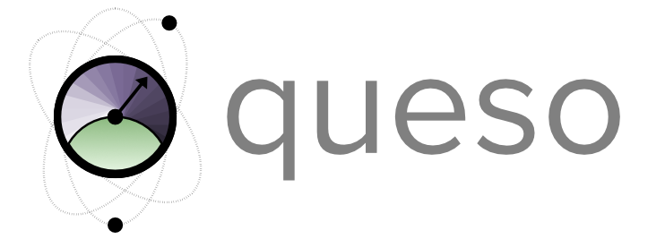

<div align="center">

# 

<h2 align="center">
    Variational quantum sensing protocols
</h2>

[](https://queso.readthedocs.io/en/latest/?badge=latest)
[](https://github.com/ambv/black)

[](https://arxiv.org/abs/2403.02394)

</div>


[//]: # (<p align="center" style="font-size:20px">)

[//]: # (    The design and optimization of quantum sensing protocols using variational methods.)

[//]: # (</p>)


## What does it do:
Explore, optimize, and benchmark circuits and estimators for quantum sensing protocols.
The quantum probe is represented as parameterized quantum circuits, and the estimators as classical neural networks.


## Basic usage:
```py
import jax
import jax.numpy as jnp
from queso.sensors import Sensor
from queso.estimators import BayesianDNNEstimator

sensor = Sensor(n=4, k=4)

theta, phi, mu = sensor.theta, sensor.phi, sensor.mu
sensor.qfi(theta, phi)
sensor.cfi(theta, phi, mu)
sensor.state(theta, phi, mu)

data = sensor.sample(theta, phi, mu, n_shots=10)

estimator = BayesianDNNEstimator()
posterior = estimator(data)
```


## Install
```bash
pip install git+https://github.com/benjimaclellan/queso.git
```
Quantum circuit simulations are done with [`tensorcircuit`](https://github.com/tencent-quantum-lab/tensorcircuit) 
with [JAX](https://github.com/google/jax) as the differentiable programming backend.
Neural networks are also built on top of JAX using the [`flax`](https://github.com/google/flax) library.

## Citing
```
@article{maclellan2024endtoend,
      title={End-to-end variational quantum sensing}, 
      author={Benjamin MacLellan and Piotr Roztocki and Stefanie Czischek and Roger G. Melko},
      year={2024},
      eprint={2403.02394},
      archivePrefix={arXiv},
      primaryClass={quant-ph}
}
```


## Acknowledgements
This project is supported by the Perimeter Institute Quantum Intelligence Lab and the 
Institute for Quantum Computing.
